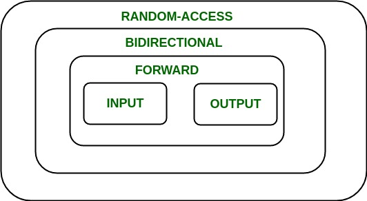
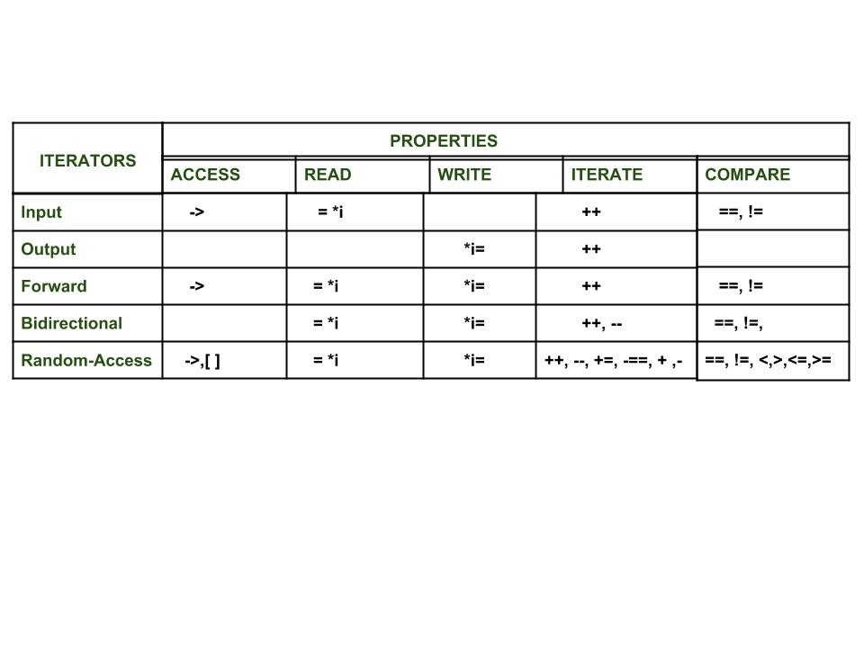

# C++ Iterators

Iterators are, just like pointer but more advanced, used to access the container elements.

Important Points: 
- Iterators are used to traverse(çapraz kullanılabilir) from one element to another element, a process is known as iterating through the container.
- The main advantage of an iterator is to provide a common interface for all the containers type.
- Iterators make the algorithm independetn of the type of the container used.
- Iterators provide a generic approach to navigate through the elements of a container.

Syntax
<ContainerType>::iterator;
<ContainerType>::const_iterator;

 Introduction to Iterators in C++ 

| English | Türkçe |
| --- | --- |
|- An iterator is an object (like a pointer) that points to an element inside the container. |- Bir iterator container içindeki bir elemenatı işaret eden bir nesnedir (bir pointer gibi). |
|- We can use iterators to move through the contents of the container. |- Container içeriği boyunca itertorler ile hareket edebiliriz. |
|- Iterators play a critical role in connecting algorithm with containers along with the manipulation of data stored inside the containers. |- Iteratörler container içindeki data manipülasyonuyla containerlar ve algoritmalar arasındaki bağlantıda önemli rol oynar. |
|-The most obvious from of an iterator is a pointer. | -Iteratorün bir işaretçi olduğu en belirgindir.|
|- A pointer can point to elements in an array and can iterate through them using the increment operator (++) |- Bir pointer ++ operatörünü kullanarak array içerisindeki elemanları iterate edebilir. |
|- But, all iterators do not have similar functionality as that of pointers.|- Fakat bütün iteratörler pointerlar gibi benzer özelliklere sahip değildir.|
|- Depending upon the functionality of iterators they can be classified into five categories, as shown in the diagram below with the outer one being the most powerful one and consequently the inner one is the least powerful in terms of functionality.| Özelliklerine göre iteratörler beş sınıfa ayrılır, aşağıdaki diagramda gösterilmiştir en dıştaki olan en güçlü özelliklere sahip olandır ve sırayle en içteki en az özelliklere sahip olandır. |

  

 List of iterator types and containers 

| Container | Iterator Type | 
| --- | --- | 
| Vector | Random-Access | 
| List | Bidirectional | 
| Map | Bidirectional | 
| Set | Bidirectional | 
| Stack | No iterator Supported | 
| Queue | No iterator Supported | 

 Interator Types Properties 

  

  
 Links 

  - https://www.javatpoint.com/cpp-iterators
  - https://www.geeksforgeeks.org/introduction-iterators-c/
  - https://www.geeksforgeeks.org/iterators-c-stl/?ref=lbp
  - https://www.geeksforgeeks.org/how-to-traverse-a-c-set-in-reverse-direction/

